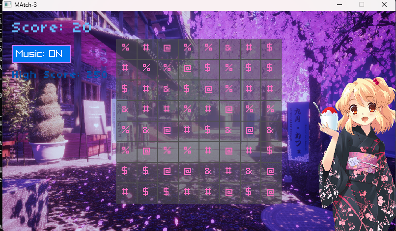

# Match-3 Game (C, Raylib)

This is a simple Match-3 puzzle game written in C using the [raylib](https://www.raylib.com/) library. The project is based on the YouTube tutorial:

**C Programming with Raylib – Match3 Game Tutorial**  
by freeCodeCamp.org  
https://youtu.be/P7PMA3X1tf8?si=eX0YK66EDjvSA96z

## Features
- Classic Match-3 gameplay
- Animated tile swapping and falling
- Score and high score tracking (saved to file)
- Music and sound effects
- Custom font and background
- **Intro screen** (added)
- **Hint system** (added)
- **Wrong move warning** (added)
- **Particle effects** (added)

## How to Play
- Swap adjacent tiles to match 3 or more of the same type in a row or column.
- Click a tile, then click an adjacent tile to swap.
- If the swap does not result in a match, the move is reverted and a red warning is shown.
- After a period of inactivity, a hint will be shown.
- Score points for every match. Try to beat your high score!
- Toggle music on/off with the button in the top left.

## Requirements
- [raylib](https://www.raylib.com/) 
- C compiler (e.g. gcc, clang, MSVC)

## Credits
- Base code and tutorial: [freeCodeCamp.org](https://www.youtube.com/@freecodecamp)

---
Enjoy the game!
